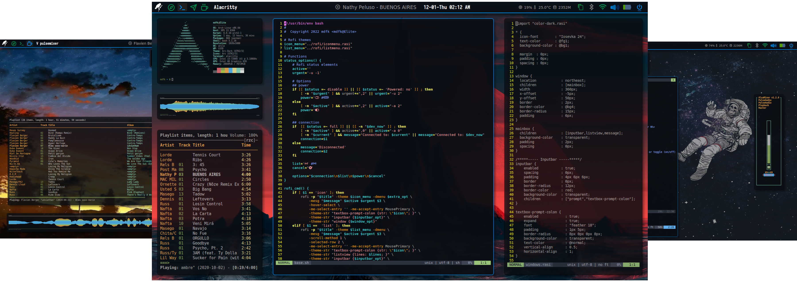
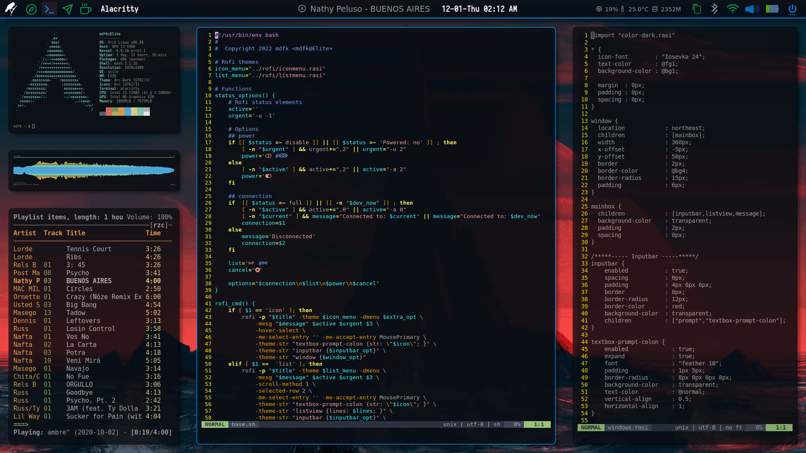
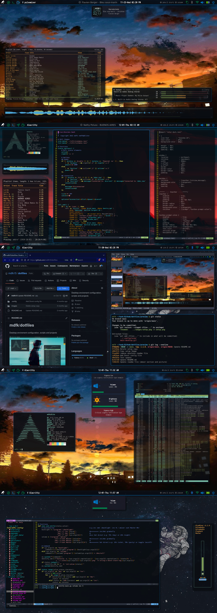
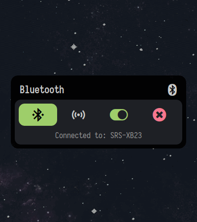

<h1>mdfk/dotfiles</h1>

<h3>Desktop envirement configuration files & scripts</h3>

## About 
- Base system: [archlinux](https://archlinux.org/)
- Window Manager and Status Bar: [qtile](https://github.com/qtile/qtile)
- Compositor: [picom](https://github.com/yshui/picom)
- Icon Fonts: [feather](https://feathericons.com/), [Iosevka Nerd Fonts](https://www.nerdfonts.com/)
- GTK theme: [arc-dark](https://github.com/jnsh/arc-theme)
- Terminal: [alacritty](https://github.com/alacritty/alacritty)
  - Editor: [neovim](https://github.com/neovim/neovim/wiki/Installing-Neovim)
- Launcher and System menu: [rofi](https://github.com/Davatorium/rofi)
- Notification: [dunst](https://github.com/dunst-project/dunst)
- Music system: [mpd daemon](https://github.com/MusicPlayerDaemon/MPD)
  - CLI controller: [mpc](https://github.com/MusicPlayerDaemon/mpc)
  - Media player: [ncmpcpp](https://github.com/ncmpcpp/ncmpcpp) 
- File manager: PCManFM
- Other applications in scrots: [rofi](https://github.com/mdfk15/Rofi), Okular, feh...

## Showcase

Setup

Wallpapers

|Blood Paradise|Burning In The Skies|
|--|--|
||

|Rukia Moonlight|Somewhere|
|--|--|
||

> **Alternatively you can check my widgets built in rofi & bash**

Rofi

|Widgets|
|--|
|

## Notes
- Archlinux is one of the most incredible linux systems for its minimalism, so in this update I have respected its premise using the minimal configuration and only the official package to ensure compatibility in many distributions.
- I found that Rofi needed to be built many widgets in the system. You can check my separated respository [here](https://github.com/mdfk15/Rofi) but this is not necessary required to run this setup config.
- There's no install script, because I'd suggest using these files as templates rather than directly copying them (simply because they weren't designed to be cross-platform). If you would like to use these files, you can try doing the following manually:
    - install `/config/` to `$CONFIG`
    - install `/scripts/` to `~/.config/scripts/`
    - install `/images/wallpapers` to `~/images/wallpapers`
